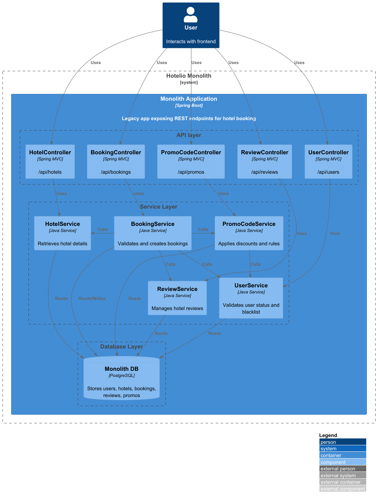
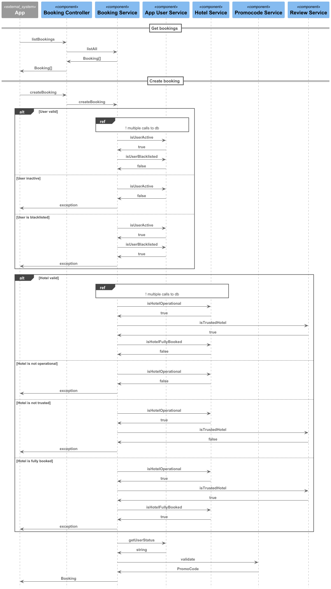
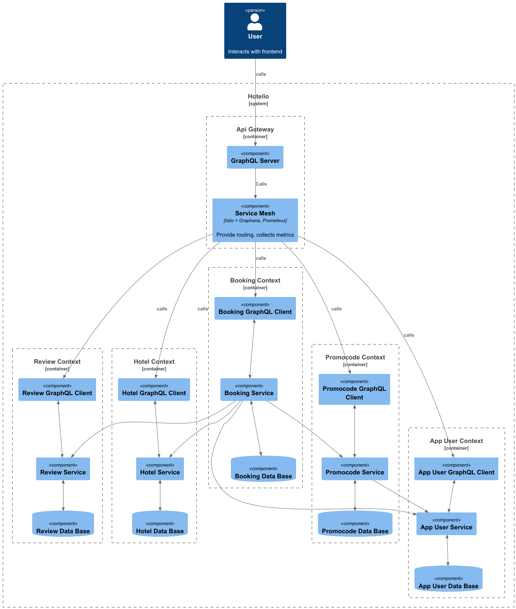
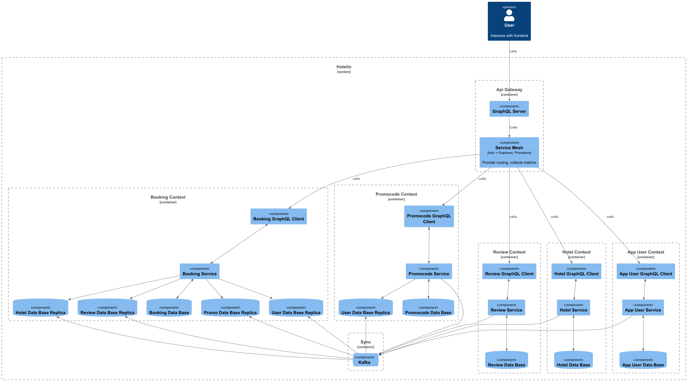
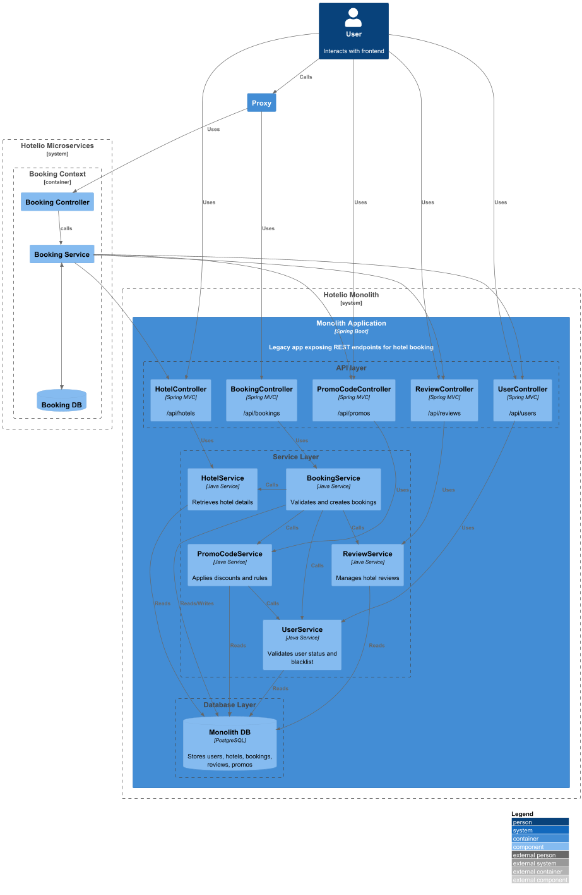

### **Название задачи:**  Hotelio
### **Автор:** Карманова Марина
### **Дата:**
### **Контекст:**
Подготовить стратегию перехода Hotelio системы на микросервисную архитектуру

### **Функциональные требования**
Опишите здесь верхнеуровневые Use Cases. Их нужно оформить в виде таблицы с пошаговым описанием.

|**№**|**Действующие лица или системы**|**Use Case**|**Описание**|
| :-: | :- | :- | :- |
|||||
### **Нефункциональные требования**
Опишите здесь нефункциональные требования и архитектурно значимые требования.

| **№** | **Требование**                               |
|:-----:|:---------------------------------------------|
|       | Полный переход на микросервисную архитектуру |
|       | Service mesh с автоматизированными rollouts  |
|       | Масштабируемая Kafka-инфраструктура          |
|       | Метрики и трассировка на каждый сервис       |
|       | GraphQL для фронтенда                        |

### **Решение**
Текущее состояние системы:

Hotelio - классический монолит, состоящий из трех слоев:
 - API - предоставляет данные для UI
 - Services - содержит бизнес логику
 - Database - хранилище данных

Booking service:
Основной функционал системы представлен в Booking Service.
Если посмотреть на Sequence диаграмму, можно отметить, что при создании бронирования происходит множество небольших запросов в другие сервисы.

To-do:
Первая версия микросервисной архитектуры предполагает разделение монолита на микросервисы по контекстам, с сохранением трех-слойной структуры.

В дальнейшем, если нагрузка на будет расти, можно будет перейти к усложненной версии:

В таком случае сервисы будут максимально независимы друг от друга, но появится сложность с синхронизацией данных между сервисами

Для перехода на микросервисы выбрали стратегию Strangler Fig. 
Booking Service содержит в себе максимальный функционал и постоянно требует доработок, при этом это единственный компонент, который не влияет на остальные компоненты.
Так что было принято решение в первую очередь переводить на микросервисы функционал бронирования

Подключение к сервису бронирований будет через прокси, который будет перенаправлять траффик либо на новый, либо на старый API
Таким образом подключение к новому сервису можно будет сделать максимально безболезненно. В случае поломки, прокси можно будет переключить на старый сервис.

### **Альтернативы**
Так же хорошим кандидатом для вынесения в отдельный микросервис может быть User Service, так как от его быстродействия зависит работа Booking Service и Promocode Service

**Недостатки, ограничения, риски**

Риски: если упадет, вся система встанет.

С другой стороны, это можно решить настройками прокси с переадресацией на старый модуль.

