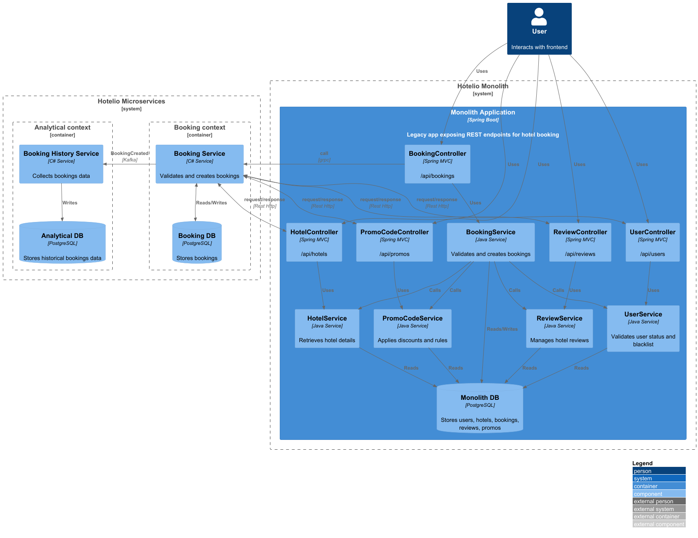
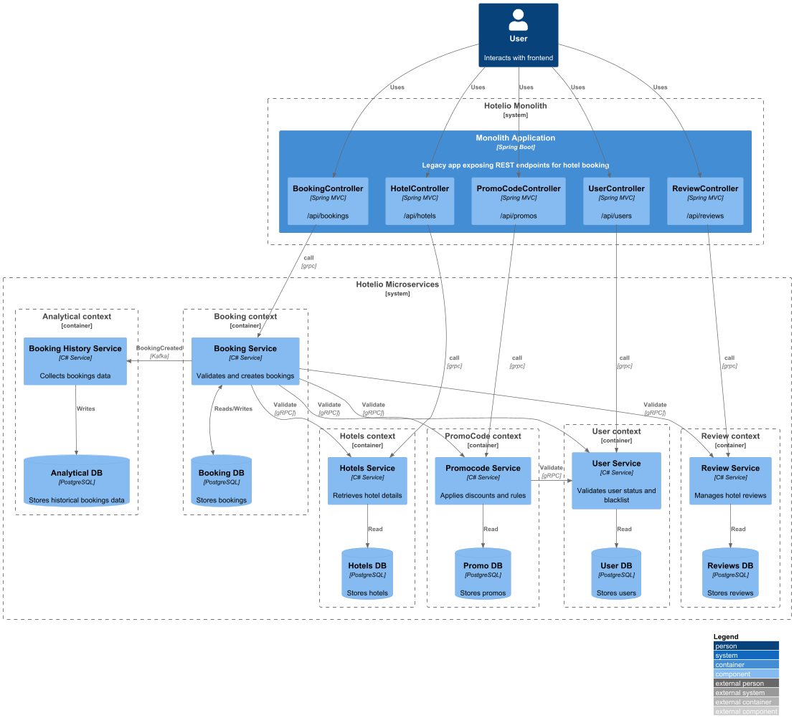
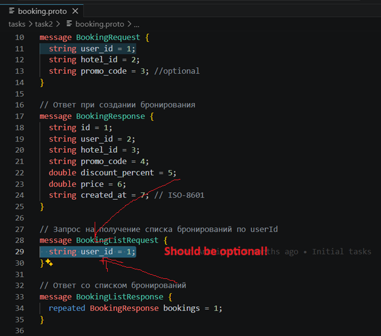
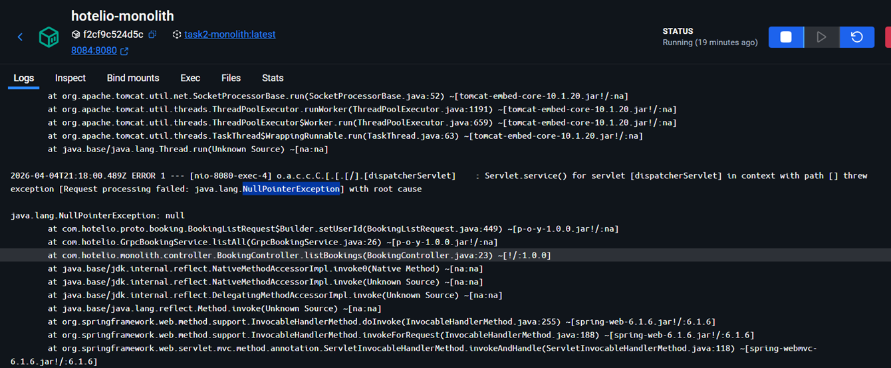

**Стратегия миграции данных**

Т.к. ресурсы компании ограничены, было принято решение использовать паттерн Strangler Fig 

В первую очередь в качестве микросервиса будет реализован Booking Service.
Booking Controller будет перенаправлять данные на новый сервис через протокол gRPC.

Общение между микросервисами было решено осуществлять через обмен сообщениями (Kafka)

Общение со старыми сервисами монолита - через интеграцию с Rest API

***Перенос данных***

Было решено использовать оффлайн перенос данных из старой БД в новую. 

Этапы:
1. Отключение системы монолита на Maintenance
2. Создание слепка данных из Monolith DB и перенос в Booking DB
3. Переключение прокси в Booking Controller c BookingService монолита на Grpc сервис
4. Включение системы

Преимущества:
- При таком подходе гарантируется целостность данных

Недостатки:
- Система будет временно неактивна для пользователей. но это неизбежно, т.к. все равно требуется остановка монолита (для внедрения прокси)

На следующем этапе старый Booking Service будет вырезан из монолита

Остальные компоненты будут перенесены в микросервисы по похожей схеме, в итоге получим подобную схему:

В данном случае монолит будет выступать единой точкой входа для API.

Про ошибки:

При текущей реализации Booking.proto запрос на список бронирований должен иметь user_id

Но монолит передает user_id = null и это возвращает ошибку:
